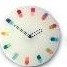

# how it works


## dataset

数据集是学习的第一步。

### download

使用脚本在 12306 网站爬取 1w 张验证码图片，日期 2020.02.14。


每张验证码中包含 **1** 个文本(text)，**8** 个图像(image)。

比如上面的验证码，文本内容为 `航母`，图像标签依次为 `冰箱 航母 黑板 剪纸 红枣 调色板 航母 红枣`。

所以 1w 张验证码包含
- 1w 个文本(text)
- 8w 个图像(image)


运行代码，下载指定数量的验证码（可从中断处继续）

```
$ python download.py -d ./dataset/download -n 10000
```

### crop

下一步，我们要将所有验证码分解为单独的部分，文本(text)图片放在一起，图像(image)图片放在一起。

text 所占的区域起始位置是固定的，但是终止位置不确定。


因为 text 用灰/黑色标识，背景是白色，多余的空间分析而进一步去除，使截取得到的 text 图片尽量只包含文字。


这样得到的 text 图片没有统一的 `shape`，无论是高度还是宽度。

相比之下，每个 image 的起始位置和大小都是固定的，只需要固定截取 8 个位置即可。


运行代码，将 text 和 image 分割到不同目录，作为训练数据（可从中断处继续）

```
$ python crop.py -d ./dataset/download -t ./dataset/raw/text -i ./dataset/raw/image
```

### label

上面已经将 text image 从验证码中分开，下一步要对数据进行**标注**，才可以提供给网络进行训练。

#### text

首先来标注 text 图片，因为相对 image 图片而言比较简单，形状比较小（平均大小约 50x30 px），纯黑白色彩。

即使如此，完全使用人工分类还是十分费力的，毕竟有 1w 条数据。

这里借助 `baidu ocr api` 进行初步的识别，后续再手动校正。


```
$ python key.py -a AK -s SK
$ python annotate.py -t text -r ./dataset/raw/text -d ./dataset/annotation/text-ocr
```

将全部 1w 条数据使用 ocr 接口识别之后，对所有结果做个数统计，降序排列，

```
$ python describe.py -d ./dataset/annotation/text-ocr
```

我们可以观察到，有明确意义的标注大约有 80+ 个（准确来说应该是 80 个），如日历，菠萝，
无意义的标注种类更多，但是每个标注对应的个数比较小，如E历，波萝。

统计纠正所有标注结果后，有理由相信，验证码 text 一共只有 80 个分类。

下一步就是要人工将所有其它错误的分类图片，分类到正确的位置。

```
$ cp -a ./dataset/annotation/text-ocr ./dataset/annotation/text
```

将 80 个分类外的结果算作识别错误，如此来看 ocr 分类的正确率大概 60%（6000+ 张识别正确）。
原因可能是因为 ocr 接口是一个通用接口，它先将图片中切块分出单字，再对单字进行识别，最后组成单字识别的结果为总结果。

由于我们知道了所有数据的分类数量，在这样一个限定的范围内训练网络进行分类，自然有理由相信要比 ocr 接口做的更好。

#### image

有了文本识别的经验，第一反映就是使用同样的思路，使用 baidu 识图接口 进行一个粗略的分类，剩下的进行人工处理。

然而不幸的是，同样的方法对于标注图片不太可行。

首先，不同于 ocr 接口，识图接口有数量限制，500次每天；
而且，由于识图接口也是一个通用接口，会得到五花八门的结果，不一定落在 80 个类中，同一个物体，可能有不同层次的描述，比如 `动物->老虎->华南虎`，所以最终得到的分类结果难以整理。

如果 12306 使用 80 个 text 分类之外的图片种类来混淆，那问题就更难了。
所幸目前并没有这样做，如果存在很多 80 分类外的图片，无论是标注还是后续训练都会更加困难。

在[另一个出色的项目](easy12306)中，有一个非常不错的想法，利用统计学的方法来分类图片。

[easy12306]: https://github.com/zhaipro/easy12306

对于一张验证码中的 8 张 image 图片，是 text 所表示的分类的可能性为 1/8，而是其它分类的可能性为 1/80。
我们可以大胆的将这 8 张图片全部进行标注为 text 所表示的分类（在 text 分类正确率非常高的情况下）。

最终标注过的 image 数据，每个分类中至少有 1/8 的图片是正确的标注，其它是错误的标注。
平均情况下，每张验证码中会有 2 个 image 是 text 所表示的分类，综合来看每个分类中大约有 1/8 - 1/4 的 image 是分类正确的。

假如 CNN 网络的确存在从图片中提取特征，进而分类图片的能力，我们就可以大胆的用这个数据集来训练网络。

可以这样理解，如果标注完全正确，正确概率和随机概率是 1/1 和 1/80 的差距；按照目前的标注方法，则是 1/8 - 1/4 和 1/80 的差距。

对于具体的单个分类来说，20% 的数据是正确标注，其余是错误的标注（其余 79 个类），正确标注的数量占比最高，
而且训练得到的网络进行分类时，使用最大概率的结果。
可以相信用这个数据集来训练，还是可以得到一个绝对正确率不错的网络。


```
$ python annotate.py -t image -r ./dataset/raw/image -d ./dataset/annotation/image-prob-00
```

**第一步训练**

用 `image-prob-00` 数据集进行第一步训练，可以看到 acc 和 val_acc 都在 20% 左右徘徊。

这个结果印证了上面所说的猜测，也间接说明了网络的分类性能，网络模型在隐约中遵从绝对正确分类的原则，但是无奈数据集不允许。

但是我们的数据不是准确分类的数据，所谓 `garbage in garbage out`，所以这里的 acc 不能完全指明状况。


在得到第一步的模型之后，利用得到的模型对所有 image 数据进行分类，作为第二步的数据集。


**第二步训练**

从上一步得到的分类数据中，我们可以看到网络的效果，在每个分类中，正确分类的图片都多了起来，远远超过了原来的 20% 的估计值，说明之前的猜测还是有些道理的。

应用同样的逻辑，自然可以在新的纯度更高的数据集中，训练出正确率更高的网络。

从这一步开始就是就是精彩的地方了，从第一步得到的新数据集中，得到 90% 以上的 acc。


但是我们依然不能从这个数字中断定，网络的分类是绝对正确的。


同第一步一样，将新的网络分类所有 image 数据，作为下一步的数据集。


**第三步训练**

过程同一二。

**第四步训练**

过程同上。


最后一步得到的网络，对所有数据进行分类，作为图像标注的自动识别结果。


查看 image 中各个分类的结果，不难发现正确率远没有达到 97%，最多 80%，需要人工调校才可以得到完全正确标注的数据集。

```
$ cp  image-prob-03  image
```

从上面的过程中，我们可以了解些什么？

分类，也可以看作相似聚类的过程，通过训练，分类，再训练的方式，可以将存在 1/8 - 1/4 比例偏置的数据，通过相似性聚集在一起。

为什么最终得到的结果有那么高的错误率？

对最终标注的结果可以看到这样一种现象，错误分类的数据都很相似，但是在已分类的图片中，没有它们的影子。

比如一张蜡烛的图片，重复多次出现在鞭炮的分类下，但是在蜡烛的分类下，即使有很多蜡烛，但是完全没有出现过这张蜡烛图片。


我们可以说网络错误分类了图片，但是因为我们的数据一开始就没有正确标注，可能上面这张蜡烛就被错误分到鞭炮类别下。
网络只是按我们告诉它的，尽力找到一种方式将所有不同的分类分开，它是否真的明白了蜡烛的含义，我想是否定的。

虽然最终我们将所有数据归为 80 个类，但是是否是唯一的分类准则呢？

就蜡烛而言，存在细蜡烛，粗蜡烛，而细蜡烛有些像鞭炮，粗蜡烛则没有那么像。
如果按照这种思维过程，则可以将 80 个类细分为很多个小类，甚至每张图片一个分类，`沐浴在日光下侧边 30 度挡在柳树前的淡蓝色路灯`。

但是这样完全将事物个性化的想法对当前的问题没有什么帮助，所以需要对所有个性的个体进行一些抽象，得到一种可以泛化的大类。

事物的分类不是绝对的，为什么蜡烛被命名为“蜡烛”？人类的词汇从何而来？也不过是凭空的发明。

这里的思想在于，最终的 80 个大类是所有小类聚合组成的，所以在同类之间差异之间过大不易找出相似特征的前提下，用于最终分类的 dense layer 要足够大，
容纳诸多细分的小类，最后再聚合为我们需要的大类。


## train

在所有数据都得到正确标注后，开始训练模型。

### text

所有 1w 张 text 图片，12306 每次提供的验证码是随机的，一共 80 个类，每个类平均约 125 张。

每个类 125 张，分去 test 部分的数据，用于 train 的可能 100 张，感觉训练数量不是太充足。
但是 text 图片着实简单，颜色和大小都有限，并且变形幅度不大，使用 CNN 可以轻易在这个数据集上得到 95% 以上的 `val_acc`。

```
$ python train.py -t ./dataset/annotate/text -o ./model/text
```

### image

image 图片共 8w 张，一共 80 个类，每个类约 1000 张图片，数据量还算可以。

image 的模型使用 VGG16 在 imagenet 训练好的模型来提取 feature，最后只用 dense layer 进行最终分类。

最终可达到 95% 的 `val_acc`。

```
$ python train.py -i ./dataset/annotate/image -o ./model/image
```

## details

### 大小

将最终模型的大小和数据集的大小相对比是一件很有趣的事。

假如数据集只有 100MB，但是得到的分类模型有 500MB 大小，这就有点夸张了。
单纯从信息的角度来看，模型要从数据集中提取特征，找出信息的关键点，应该是信息的提炼和压缩，最终模型反而大那么多就有些不合理了。

这一点是鼓励在精度相同的情况下，我们要找到更小的模型，从而提取更准确的信息。

以我们的 text 和 image 数据集来看，text 数据共 13.3MB，image 数据共 255.4MB，
再者数据集存在大量重复，假如重复度为 4，则两者模型的大小应该是多少合适呢？

### 分类出错

观察最终得到的图片分类模型，发现剪纸是特别容易出错的分类，几乎每个分类中都多少有一些剪纸。

这里提出一种猜测，因为剪纸比较纯粹，只有白底和红字，其中红字中有大部分是镂空的，这就极容易“造”出一种剪纸，使其落在别的分类中。
而其它分类的物体多少是有一些固定的模式的，并且颜色也与模式相配合，比如海鸥的体形，身体是雪白的，嘴巴是黑色的。


### 单分类？多分类？

一开始我们假设所有 image 图片都落在 80 个分类中，这一点到目前观察来看，似乎没什么问题。

但是 image 分类是不是单分类的还需要商榷。

有两个分类让我一度非常疑惑，挂钟 和 钟表。

除了手表，闹钟，秒表被划归为钟表，其它的数据存在大量的相似。



终其原因，还是因为挂钟属于钟表的子类。所以如果在一张验证码上出现了挂钟，但是让你选钟表，你选还是不选呢？


又比如 海报，将东西印刷在纸制底面上，就可以理解为是一种海报，但是如果纸上印刷了蜡烛并加上 merry christmas，那应该将其认作什么呢？


最初关于 image 数据集的假设，不一定完全正确，可能存在少量的多分类情况。

具体还是要在实践中检验，如果两张几乎相同的图片在不同的验证码中被要求不同的标注，那么其就应该有多个标注，是多分类的一种情况。

这一点留待之后再检验吧，用单分类的假设得到精度还是可以的。


