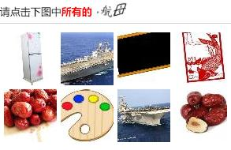
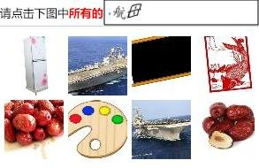
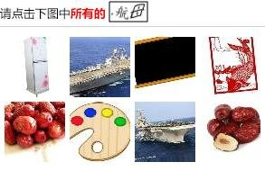

# how it works


## dataset

数据集是学习的第一步。

### download

使用脚本在 12306 网站爬取 1w 张验证码图片，日期 2020.02.14。



每张验证码中包含 **1** 个文本(text)，**8** 个图像(image)。

比如上面的验证码，文本内容为 `航母`，图像标签依次为 `冰箱 航母 黑板 剪纸 红枣 调色板 航母 红枣`。

所以 1w 张验证码包含
- 1w 个文本(text)
- 8w 个图像(image)


运行代码，下载指定数量的验证码（可从中断处继续）

```
$ python download.py -d ./dataset/download -n 10000
```

### crop

下一步，我们要将所有验证码分解为单独的部分，文本(text)图片放在一起，图像(image)图片放在一起。

text 所占的区域起始位置是固定的，但是终止位置不确定。



因为 text 用灰/黑色标识，背景是白色，多余的空间分析而进一步去除，使截取得到的 text 图片尽量只包含文字。



这样得到的 text 图片没有统一的 `shape`，无论是高度还是宽度。

相比之下，每个 image 的起始位置和大小都是固定的，只需要固定截取 8 个位置即可。


运行代码，将 text 和 image 分割到不同目录，作为训练数据（可从中断处继续）

```
$ python crop.py -d ./dataset/download -t ./dataset/raw/text -i ./dataset/raw/image
```

### label

上面已经将 text image 从验证码中分开，下一步要对数据进行**标注**，才可以提供给网络进行训练。

#### text

首先来标注 text 图片，因为相对 image 图片而言比较简单，形状比较小（平均大小约 50x30 px），纯黑白色彩。

即使如此，完全使用人工分类还是十分费力的，毕竟有 1w 条数据。

这里借助 `baidu ocr api` 进行初步的识别，后续再手动校正。


```
$ python annotate.py -t ./dataset/raw/text -d ./dataset/annotate/text-ocr
```

将全部 1w 条数据使用 ocr 接口识别之后，对所有结果做个数统计，从降序排列，

```
$ todo list result
```

我们可以观察到，有明确意义的标注大约有 80+ 个（准确来说应该是 80 个），如日历，菠萝，
无意义的标注种类更多，但是每个标注对应的个数比较小，如E历，波萝。

统计纠正所有标注结果后，有理由相信，验证码 text 一共只有 80 个分类。

下一步就是要人工将所有其它错误的分类图片，移动到正确分类的位置。

将 80 个分类外的结果算作识别错误，如此来看 ocr 分类的正确率大概 60%（6000+ 张识别正确）。
原因可能是因为 ocr 接口是一个通用接口，它先将图片中切块分出单字，再对单字进行识别，最后组成单字识别的结果为总结果。

由于我们知道了所有数据的分类数量，在这样一个限定的范围内训练网络进行分类，自然有理由相信要比 ocr 接口做的更好。


#### image

有了文本识别的经验，第一反映就是使用同样的思路，使用 baidu 识图接口 进行一个粗略的分类，剩下的进行人工处理。

然而不幸的是，同样的方法对于标注图片不太可行。

首先，不同于 ocr 接口，识图接口有数量限制，500次每天；
而且，由于识图接口也是一个通用接口，会得到五花八门的结果，不一定落在 80 个类中，同一个物体，可能有不同层次的描述，比如 `动物->老虎->华南虎`，所以最终得到的分类结果难以整理。

如果 12306 使用 80 个 text 分类之外的图片种类来混淆，那问题就更难了。
所幸目前并没有这样做，如果存在很多 80 分类外的图片，无论是标注还是后续训练都会更加困难。

在[另一个出色的项目](easy12306)中，有一个非常不错的想法，利用统计学的方法来分类图片。

[easy12306]: https://github.com/zhaipro/easy12306

对于一张验证码中的 8 张 image 图片，是 text 所表示的分类的可能性为 1/8，而是其它分类的可能性为 1/80。
我们可以大胆的将这 8 张图片全部进行标注为 text 所表示的分类（在 text 分类正确率非常高的情况下）。

最终标注过的 image 数据，每个分类中至少有 1/8 的图片是正确的标注，其它是错误的标注。
平均情况下，每张验证码中会有 2 个 image 是 text 所表示的分类，综合来看每个分类中大约有 1/8 - 1/4 的 image 是分类正确的。


如果 CNN 网络的确有从图片中提取特征，进而分类图片的能力，我们就可以大胆的用这个数据集来训练网络。

这一点可以这样理解，如果标注完全正确，正确概率和随机概率是 1/1 和 1/80 的差距；
按照目前的标注方法，则是 1/8 - 1/4 和 1/80 的差距。

对于具体的分类来说，20% 的数据是正确标注，其余是错误的标注（剩下的 79 个类），
正确标注的数量占比最高，
而且训练得到的网络进行分类时，使用最大概率的结果，
所以可以相信用这个数据集来训练，还是可以得到一个正确率不错的网络。


第一步训练

第一步训练，可以看到 acc 和 val_acc 都在 20% 左右徘徊。

这个结果印证了上面所说的猜测

因为我们的数据不是准确分类的数据，所以 acc 不能完全说明问题。


第二步训练


后面就是精彩的地方了

我们用上一步得到的网络，分类全部 image 数据（train + test），
作为下一步训练的数据集。

为什么？

在新的分类数据中，我们可以看到网络的效果，在每个分类中，正确分类的图片都多了起来，超过了原来的 20% 的估计。

应用同样的逻辑，自然可以在新的纯度更高的数据集中，训练出正确率更高的网络。

三


四


97% 是虚假的数字，因为数据本身并非 100%正确分类。


分类，即相似聚类的过程

通过 训练，分类，再训练的方式

有 1/8 - 1/4 的偏置

大部分都通过相似性聚集在一起

有错误的分类

达到 20%

一是数据不纯净，

数据量少

错误分类的数据都很相似，但是在已分类的图片中，没有它们的影子

80 个大类聚集

更多小类的聚集组成

人工规定

真的得到了智能？不如说是精确的模仿

而人类的词汇从何而来，也只是凭空的发明。


### train

在所有数据都得到正确标注后，开始训练模型。

#### text

所有 1w 张 text 图片，12306 每次提供的验证码是随机的，一共 80 个类，每个类平均约 125 张。

每个类 125 张，分去 test 部分的数据，用于 train 的可能 100 张，感觉训练数量不是太充足。

但是 text 图片着实简单，颜色和大小都有限，并且变形幅度不大，使用 `LeNet` 在这个数据集上训练完全足够，模型 `val_acc` 可达到95%。


```
$ python train.py -t ./dataset/annotate/text -o ./model/text
```

#### image

image 图片共 8w 张，一共 80 个类，每个类约 1000 张图片，数据量还算可以。

image 训练使用 VGG16 在 imagenet 训练好的模型，使用 fine tuning 来训练。

```
$ python train.py -i ./dataset/annotate/image -o ./model/image
```


## usage

```
$ python parse.py
```

or

```
$ python parse.py -i ./dataset/download/00001.jpg
```
